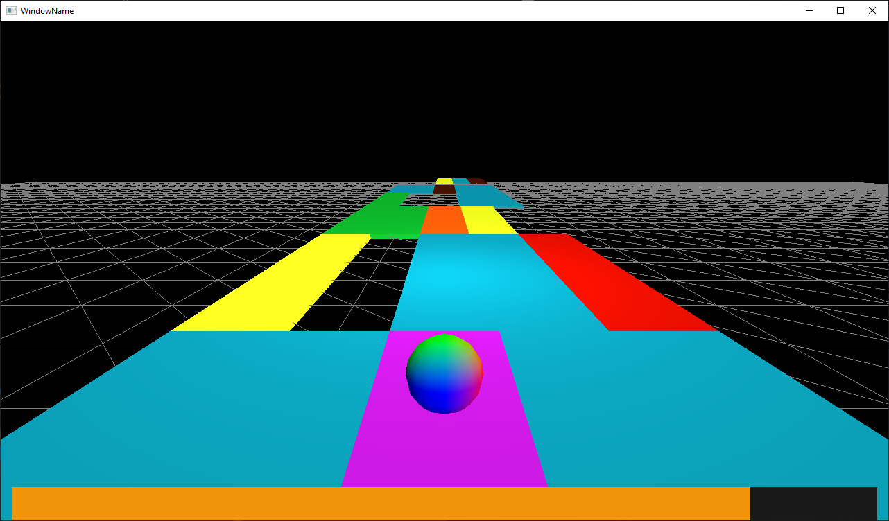

# Skyroads-like 3D game

### Description

A Skyroads-style 3D game

Tech stack:
 * C++
 * OpenGL
 * EGC Framework

### Features

 * 5 levels with increasing difficulty
 * 6 types of platforms with different effects / power-ups
 * Fuel bar that keeps the player on their toes
 * Animations and graphic design

### Download

Download zip from the [Releases section](https://github.com/alexandra-luca/egc-tema2/releases/tag/v2.0)
